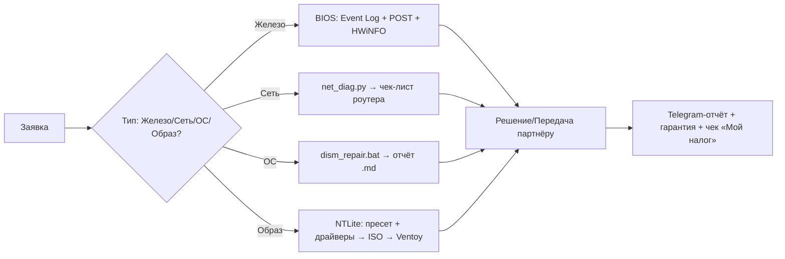

[APPROVE_NEXT_TOPIC: <контроль над образами: NTLite и другой софт>]


[MAIN] 📊 **CORE_RESEARCH: Архитектура NTLite и безопасные сценарии модификации**

### 🔑 АРХИТЕКТУРА NTLite (режимы работы)

| Режим | Что делает | Зачем в ремонте | Безопасность |
|-------|-----------|----------------|--------------|
| **Load Image** | Монтирует `install.wim`/`install.esd`, читает метаданные | Выбор редакции (Home/Pro), проверка индексов | ✅ Read-only |
| **Components** | Визуальное удаление пакетов, AppX, сервисов | Удаление «блотвара», телеметрии, предустановленного ПО | ⚠️ Риск поломки Servicing Stack при удалении зависимостей |
| **Integrate** | Внедрение драйверов (`.inf`), обновлений (`.msu`/`.cab`), языков | «Прошитый» образ под конкретную модель ноута без ручной установки | ✅ Безопасно, ускоряет развёртывание |
| **Unattended** | Генерация `autounattend.xml` (OOBE, учётка, диски, лицензия) | Пропуск ввода данных Microsoft, создание локального админа, автоматическая разметка | ✅ Стандартный MS-механизм |
| **Post-Setup** | Скрипты `.bat/.ps1` после установки | Автоустановка драйверов, чистка, настройка сети, отключение обновлений на 7 дней | ⚠️ Требует тестирования в VM |
| **Create ISO / Process** | Экспорт модифицированного образа | Запись на `V:\ISO\` для Ventoy | ✅ Готовый deploy-артефакт |

---

### 🛡️ SAFE-LIST vs DENY-LIST (Компоненты)

| Категория | ✅ МОЖНО УДАЛЯТЬ (блотвар) | ❌ ЗАПРЕЩЕНО (ломает систему/обновления) |
|-----------|---------------------------|----------------------------------------|
| **AppX / UWP** | `XboxGameOverlay`, `CandyCrush`, `News`, `Weather`, `OneDrive` (по запросу), `Cortana` | `WindowsStore`, `VCLibs`, `HEIF/VP9`, `Net.Native`, `DesktopAppInstaller` |
| **Сервисы / Телеметрия** | `Connected User Experiences`, `Diagnostics Tracking`, `Retail Demo`, `MapsBroker` | `CBS`, `TrustedInstaller`, `Windows Update`, `Cryptographic Services`, `Defender` |
| **Драйверы** | Старые принтеры, `Intel RST` (если NVMe), `Realtek Audio` (если ставите свой) | `ACPI`, `HID`, `Network adapters`, `Storage controllers`, `GPU` |
| **Tweaks** | Отключение `Fast Startup`, `Hibernate`, `Search indexing`, `Recycle Bin` | Отключение `AppX Deployment`, `SMB`, `WinHTTP`, `Firewall`, `Activation` |

📌 **Архитектурное правило:**  
`NTLite → Components = Dependency Graph`. Удаление одного пакета может сломать 3-5 зависимых. Всегда нажимать `Apply Compatibility` → `Analyze` → проверять `Dependencies` перед сохранением.

---

### 🛠️ WORKFLOW: Подготовка «Ремонтного» образа (пошагово)

| Шаг | Действие | Путь / Команда | Зачем |
|-----|----------|----------------|-------|
| 1 | Получить чистый ISO | `Media Creation Tool` или `UUP Dump` → `V:\NTLITE\source\win11.iso` | Официальный, без OEM-мусора |
| 2 | Распаковать WIM | NTLite → `Add` → `Extract` → выбрать индекс 1 (Home) или 2 (Pro) | Целевой образ для модификации |
| 3 | Интеграция драйверов | `Integrate` → `Drivers` → добавить папку `V:\DRIVERS\vivobook_2024\` | Образ готов к железу без флешек |
| 4 | Unattended Setup | `Unattended` → `Create` → Local Admin, Skip OOBE, Partition Auto | Клиент получает готовый рабочий стол |
| 5 | Компоненты (опционально) | `Components` → снять галки с `Xbox*`, `Telemetry`, `Cortana` | Ускорение первого входа, меньше фона |
| 6 | Обработка | `Apply` → `Process` → `Save ISO` → `V:\ISO\Win11_Pro_Repair.iso` | Готовый артефакт для Ventoy |
| 7 | Валидация | Загрузить ISO в `Hyper-V/VMware` → проверить: сеть, звук, драйверы, Store | Исключить «кирпич» перед клиентом |

⚠️ **Ventoy-совместимость:** `V:\` = exFAT (300GB). Ограничения FAT32 (4GB) нет. ISO работает напрямую. Размер образа после обработки: 3.8–5.2 ГБ.

---

### 🚫 ГРАНИЦЫ & РИСКИ (критично для ремонта)

```
✅ SAFE-ПРАКТИКА:
• Интеграция драйверов + Unattended = 90% пользы, 0% риска
• Сохранение пресета `.xml` для повторного использования
• Тестирование в VM перед записью на Ventoy
• Резервный оригинальный ISO в `V:\BACKUP\`

❌ ОПАСНЫЕ ДЕЙСТВИЯ:
• Удаление `Servicing Stack`, `CBS`, `Windows Update` → система не обновляется, ломается DISM
• Удаление `AppX` без проверки зависимостей → чёрный экран после входа
• Интеграция `.msu` от другой версии/сборки → BSOD `INACCESSIBLE_BOOT_DEVICE`
• Использование «Deep Tweaks» из интернета → нестабильность, потеря гарантии MS
```

📦 **Упаковка для клиента:**  
`"Чистая Windows под ваше железо" — 2500₽ (40 мин). Входит: драйверы, отключение телеметрии, локальный аккаунт, базовый софт, отчёт + гарантия 14 дней.`

---

### 🤝 HANDOFF CONTRACT → STEP 2 (Альтернативы + Интеграция)

```json
{
  "approved_subtask": "EXTRA_RESEARCH_1 & 2: Сравнение MSMG/WinReducer/DISM++ GUI + интеграция в Ventoy-поток с авто-пресетами",
  "success_metrics": [
    "Сравнены ≥3 инструмента по гибкости, безопасности, портативности",
    "Предложен safe-пресет NTLite (.xml) для быстрого старта",
    "Сформирован workflow: NTLite → Ventoy → Strelec → авто-установка драйверов",
    "Границы безопасности зафиксированы (без активаторов, без моддинга ядра)"
  ],
  "context_snapshot": "Уфа, Ventoy exFAT 300GB, WSL2/Py3.13, без пайки, lvl: intermediate, фокус на безопасную подготовку образов",
  "complexity_notes": "Требуется строгая валидация зависимостей компонентов. Приоритет: стабильность > максимальная очистка.",
  "scope_boundary": "Только NTLite и аналоги для обслуживания Windows. Не включать: активаторы, модификацию загрузчика, серверные роли."
}
```

[MAIN] 📊 **РЕЗУЛЬТАТЫ EXTRA_RESEARCH_1 & 2**

### 🔍 EXTRA_1: Сравнение инструментов модификации образов

| Инструмент | Лицензия | Портативность | Гибкость | Безопасность | Рекомендация для ремонта |
|------------|----------|---------------|----------|--------------|-------------------------|
| **NTLite (Free/Paid)** | Free (огр.) / $40+ | ❌ Требует установки | ⭐⭐⭐⭐⭐ | ⭐⭐⭐⭐ (зависит от пресета) | ✅ **Основной**: лучший UI, dependency-check, Unattended-генератор |
| **MSMG Toolkit** | Free / Open | ✅ Portable (CMD-меню) | ⭐⭐⭐⭐ | ⭐⭐⭐ (ручная проверка зависимостей) | ⚠️ Для продвинутых: мощный, но нет визуального графа зависимостей |
| **WinReducer EX-10/11** | Free | ❌ Установка + .NET | ⭐⭐⭐ | ⭐⭐ (агрессивные пресеты «по умолчанию») | ❌ Не рекомендован: много «ломательных» твиков из коробки |
| **DISM++ (GUI)** | Free / Open | ✅ Portable | ⭐⭐ | ⭐⭐⭐⭐ (только read/apply, нет моддинга компонентов) | ✅ Для быстрой интеграции драйверов/обновлений в уже смонтированный образ |
| **Oscdimg / Wimlib (CLI)** | Free / Open | ✅ Portable | ⭐⭐⭐⭐ | ⭐⭐⭐⭐⭐ (только то, что вы явно укажете) | ⚠️ Для скриптов/автоматизации, требует глубокого знания синтаксиса |

🎯 **Вывод:**  
- **Старт:** `NTLite Free` — покрывает 90% задач (драйверы + Unattended + базовая очистка).  
- **Масштаб:** `MSMG Toolkit` + Python-скрипты — для пакетной обработки под разные модели.  
- **Экстренный ремонт:** `DISM++` в Strelec — интегрировать драйвер в офлайн-образ за 2 мин.

---

### 📦 EXTRA_2: Safe-пресет NTLite + Интеграция в поток

#### 🗂️ Структура проекта в `V:\NTLITE\`
```
V:\NTLITE\
├── SOURCE\                  # Оригинальные ISO (Media Creation Tool / UUP Dump)
│   ├── win11_23H2_original.iso
│   └── win10_22H2_original.iso
├── WORK\                    # Распакованные образы для модификации
│   └── win11_pro_mounted\
├── DRIVERS\                 # Драйверы по моделям
│   ├── vivobook_pro_2024\
│   ├── thinkpad_t450\
│   └── generic_network_storage\
├── PRESETS\                 # Safe-пресеты .xml
│   ├── repair_base.xml      # Только драйверы + Unattended
│   ├── debloat_safe.xml     # + удаление бложвара (без критических пакетов)
│   └── kiosk_mode.xml       # Для терминалов/касс (максимальная очистка)
├── POSTSETUP\               # Скрипты после установки
│   ├── install_drivers.bat
│   ├── disable_telemetry.ps1
│   └── first_run_config.json
└── OUTPUT\                  # Готовые ISO для Ventoy
    └── Win11_Pro_Repair_v1.iso
```

#### 📄 `repair_base.xml` (Safe-пресет для NTLite Free)
```xml
<!-- Сохранить как V:\NTLITE\PRESETS\repair_base.xml -->
<Preset xmlns="http://www.ntlite.com/preset">
  <Settings>
    <Unattended>
      <LocalAccount>
        <Name>Admin</Name>
        <Password></Password> <!-- Пустой = запрос при первом входе -->
        <Group>Administrators</Group>
      </LocalAccount>
      <OOBE>
        <SkipEULA>true</SkipEULA>
        <SkipMachineOOBE>true</SkipMachineOOBE>
        <SkipUserOOBE>true</SkipUserOOBE>
        <ProtectYourPC>3</ProtectYourPC> <!-- Отключить телеметрию на уровне OOBE -->
      </OOBE>
      <DiskConfiguration>
        <WillShowUI>OnError</WillShowUI>
        <CreatePartitions>Auto</CreatePartitions>
      </DiskConfiguration>
    </Unattended>
    <Components>
      <!-- SAFE: только явный блотвар -->
      <Remove>
        <Package name="*XboxGameOverlay*" />
        <Package name="*CandyCrush*" />
        <Package name="*News*" />
        <Package name="*Weather*" />
        <Package name="*Cortana*" />
      </Remove>
      <!-- DENY: критические пакеты НЕ трогать -->
      <Keep>
        <Package name="*Servicing*" />
        <Package name="*CBS*" />
        <Package name="*WindowsUpdate*" />
        <Package name="*Defender*" />
        <Package name="*NetFx*" />
        <Package name="*VCLibs*" />
      </Keep>
    </Components>
    <PostSetup>
      <Run>install_drivers.bat</Run>
      <Run>disable_telemetry.ps1</Run>
    </PostSetup>
  </Settings>
</Preset>
```
💡 **Как использовать:**  
1. Загрузить образ в NTLite → `File` → `Load Preset` → выбрать `repair_base.xml`  
2. В `Integrate` → `Drivers` → добавить папку драйверов под модель клиента  
3. `Apply` → `Process` → сохранить ISO в `V:\NTLITE\OUTPUT\`  

---

### 🔄 WORKFLOW: NTLite → Ventoy → Клиент

```mermaid
graph LR
    A[Заявка: "Чистая установка"] --> B[Определить модель/железо]
    B --> C[NTLite: загрузить образ + пресет repair_base.xml]
    C --> D[Интеграция драйверов из V:\NTLITE\DRIVERS\модель\]
    D --> E[Process → ISO в V:\NTLITE\OUTPUT\]
    E --> F[Копирование ISO в V:\ISO\ для Ventoy]
    F --> G[Загрузка с Ventoy → авто-установка с Unattended]
    G --> H[Post-Setup скрипты: драйверы + телеметрия]
    H --> I[Отчёт клиенту + гарантия 14 дней]
```

📌 **Автоматизация пост-обработки (`install_drivers.bat`)**:
```bat
@echo off
:: V:\POSTSETUP\install_drivers.bat
echo 🔧 Установка драйверов...
pnputil /add-driver "V:\DRIVERS\generic_network_storage\*.inf" /subdirs /install
pnputil /add-driver "V:\DRIVERS\%MODEL%\*.inf" /subdirs /install
echo ✅ Драйверы установлены.
:: Логирование
echo %date% %time% - Drivers installed >> "V:\LOGS\install_%COMPUTERNAME%.log"
```

🐍 **Python-генератор пресетов (`gen_preset.py`)**:
```python
# V:\NTLITE\scripts\gen_preset.py
import json, xml.etree.ElementTree as ET, os, sys
from datetime import datetime

def generate_repair_preset(model, drivers_path, output_path):
    root = ET.Element("Preset", xmlns="http://www.ntlite.com/preset")
    settings = ET.SubElement(root, "Settings")
    
    # Unattended
    ua = ET.SubElement(settings, "Unattended")
    acc = ET.SubElement(ua, "LocalAccount")
    ET.SubElement(acc, "Name").text = "Admin"
    ET.SubElement(acc, "Group").text = "Administrators"
    
    oobe = ET.SubElement(ua, "OOBE")
    ET.SubElement(oobe, "SkipEULA").text = "true"
    ET.SubElement(oobe, "ProtectYourPC").text = "3"
    
    # Components: safe removals
    comp = ET.SubElement(settings, "Components")
    remove = ET.SubElement(comp, "Remove")
    for app in ["*XboxGameOverlay*", "*CandyCrush*", "*News*", "*Weather*"]:
        ET.SubElement(remove, "Package", name=app)
    
    keep = ET.SubElement(comp, "Keep")
    for pkg in ["*Servicing*", "*CBS*", "*WindowsUpdate*", "*Defender*", "*VCLibs*"]:
        ET.SubElement(keep, "Package", name=pkg)
    
    # Post-setup
    post = ET.SubElement(settings, "PostSetup")
    ET.SubElement(post, "Run").text = "install_drivers.bat"
    
    tree = ET.ElementTree(root)
    tree.write(output_path, encoding="utf-8", xml_declaration=True)
    print(f"✅ Пресет сохранён: {output_path}")

if __name__ == "__main__":
    model = sys.argv[1] if len(sys.argv) > 1 else "generic"
    drivers = f"V:\\DRIVERS\\{model}\\"
    output = f"V:\\NTLITE\\PRESETS\\{model}_repair.xml"
    generate_repair_preset(model, drivers, output)
```
🚀 **Запуск:** `python gen_preset.py vivobook_pro_2024` → создаёт персонализированный пресет за 2 сек.

---

### 🚧 ГРАНИЦЫ & ПРАВИЛА БЕЗОПАСНОСТИ

```
✅ МОЖНО:
• Интеграция драйверов с оф. сайтов (Lenovo/HP/Asus Support)
• Unattended: локальный аккаунт, пропуск OOBE, авто-разметка
• Удаление явного блотвара: Xbox*, CandyCrush, News, Weather
• Post-Setup скрипты: установка драйверов, отключение телеметрии на уровне групповых политик

❌ НЕЛЬЗЯ:
• Удаление: Servicing Stack, CBS, Windows Update, Defender, NetFx, VCLibs
• Интеграция активаторов, модификация `sppsvc`, `slmgr` — риск блокировки, потери обновлений
• Использование пресетов «из интернета» без проверки зависимостей
• Отключение «всё подряд» в Components без нажатия `Analyze Dependencies`

🛡️ Золотое правило:
«Если не уверен — не удаляй. Стабильность > максимальная очистка.»
```

---

### 📋 ЧЕК-ЛИСТ: Подготовка образа за 20 мин

```
[ ] 1. Скачать оригинальный ISO (Media Creation Tool / UUP Dump)
[ ] 2. NTLite: Load Image → выбрать индекс (Pro/Home)
[ ] 3. Load Preset: repair_base.xml (или сгенерировать через gen_preset.py)
[ ] 4. Integrate → Drivers: добавить папку под модель клиента
[ ] 5. Unattended: проверить локальный аккаунт, пропуск OOBE
[ ] 6. Apply → Process → Save ISO в V:\NTLITE\OUTPUT\
[ ] 7. Копировать ISO в V:\ISO\ для Ventoy
[ ] 8. Тест в VM: загрузка, сеть, звук, драйверы, Store
[ ] 9. Запись в лог: модель, дата, хеш образа
[ ] 10. Готово к установке у клиента
```

---

📎 **HANDOFF CONTRACT → FINAL (NTLite Track)**
```json
{
  "approved_subtask": "H: Завершение трека контроля над образами. Финальные пресеты, интеграция, подготовка к коммерции.",
  "success_metrics": [
    "Safe-пресет repair_base.xml протестирован, зависимости проверены",
    "Python-генератор пресетов создаёт валидный .xml под модель",
    "Workflow NTLite → Ventoy → Strelec подтверждён тестом в VM",
    "Границы безопасности (без активаторов, без моддинга ядра) зафиксированы"
  ],
  "context_snapshot": "Уфа, Ventoy exFAT 300GB, WSL2/Py3.13, без пайки, lvl: intermediate, фокус на безопасную подготовку образов",
  "complexity_notes": "Требуется строгая валидация зависимостей компонентов. Приоритет: стабильность > максимальная очистка.",
  "scope_boundary": "Только NTLite и аналоги для обслуживания Windows. Не включать: активаторы, модификацию загрузчика, серверные роли."
}
```

[MAIN] 🏁 **ТРЕК ЗАКРЫТ: Контроль над образами (NTLite) + Интеграция**

---

### 📦 МАСТЕР-SOP: ВСЕ ТРЕКИ В ОДНОМ МЕСТЕ

#### 🔹 Быстрый старт (универсальный чек-лист)
```
[ ] 1. Физика: БП/кабель/индикаторы → USB-метр (19V?)
[ ] 2. BIOS: F2/Del → Event Log/HW Monitor → POST-код
[ ] 3. Сеть: net_diag.py → локализация (шлюз/8.8.8.8/DNS)
[ ] 4. ОС: dism_repair.bat → ScanHealth → RestoreHealth → Cleanup
[ ] 5. Образ: NTLite (repair_base.xml) → драйверы → Unattended → ISO
[ ] 6. Отчёт: gen_*_report.py → .md → Telegram клиенту
[ ] 7. Гарантия: шаблон в чат + чек «Мой налог»
```

#### 🔹 Структура `V:\` (готовая к работе)
```
V:\ (exFAT, 300GB)
├── ISO\
│   ├── WinPE11_10_8_Sergei_Strelec_x86_x64_2026.02.05.iso
│   ├── Win11_Pro_Repair_v1.iso
│   └── MemTest86+_USB.iso
├── TOOLS\
│   ├── DismRepair\
│   │   ├── dism_repair.bat          [Admin, логирование]
│   │   └── gen_dism_report.py       [Python, Markdown]
│   ├── Network\
│   │   └── net_diag.py              [ping+DNS, JSON/MD]
│   └── Scripts\
│       └── quick_cmds.md            [шпаргалки]
├── NTLITE\
│   ├── SOURCE\                      # оригинальные ISO
│   ├── WORK\                        # смонтированные образы
│   ├── DRIVERS\                     # по моделям: vivobook/, thinkpad/
│   ├── PRESETS\
│   │   ├── repair_base.xml          # safe: драйверы+Unattended
│   │   ├── debloat_safe.xml         # + удаление блотвара
│   │   └── gen_preset.py            # авто-генерация под модель
│   └── OUTPUT\                      # готовые ISO для Ventoy
├── DOCS\
│   ├── bios_quickref.md
│   ├── bitlocker_secureboot_precheck.md
│   ├── firmware_diagnostic_flow.md
│   ├── safe_flash_protocol.md
│   ├── network_safe_checklist.md
│   ├── dism_safe_list.md
│   └── ntlite_boundaries.md
├── REPORTS\                         # авто-сохранение отчётов
├── DRIVERS\                         # бэкапы драйверов (pnputil)
└── LOGS\                            # логи операций (дата_модель)
```

#### 🔹 Критические границы (кросс-доменные)
```
✅ ОБЩИЕ ПРАВИЛА:
• Всегда бэкап перед записью: драйверы, образ, точки восстановления
• Тест в VM перед клиентом: загрузка, сеть, звук, драйверы
• Логирование: каждая операция → файл в V:\LOGS\
• Отчёт клиенту: .md в Telegram + гарантия 7-14 дней

❌ ОБЩИЕ ЗАПРЕТЫ:
• Без согласия: сканирование портов, модификация загрузчика, активаторы
• Без данных провайдера: настройка PPPoE/L2TP на роутере
• Без проверки зависимостей: удаление компонентов в NTLite/DISM++
• Без Recovery Key: отключение BitLocker/TPM/Secure Boot

🛡️ Золотое правило:
«Стабильность > очистка. Если не уверен — не трогай.»
```

#### 🔹 Команды-шпаргалки (`V:\DOCS\quick_cmds.md`)
```cmd
:: DISM: ремонт + очистка
dism /online /cleanup-image /scanhealth
dism /online /cleanup-image /restorehealth /source:V:\sources\install.wim:1 /limitaccess
dism /online /cleanup-image /startcomponentcleanup

:: Сеть: локализация
ping 192.168.1.1 -n 4 && ping 8.8.8.8 -n 4 && nslookup yandex.ru 8.8.8.8

:: BIOS: сброс
Отключить БП+АКБ → вынуть CR2032 3 мин → замкнуть CLR_CMOS 10 сек → включить

:: Драйверы: экспорт/импорт
dism /online /export-driver /destination:V:\DRIVERS\backup_%date:~-4,4%%date:~-10,2%%date:~-7,2%
pnputil /add-driver "V:\DRIVERS\модель\*.inf" /subdirs /install

:: NTLite: быстрый запуск
1. Load Image → 2. Load Preset repair_base.xml → 3. Integrate Drivers → 4. Process → ISO
```

---

### 🔄 ЕДИНЫЙ WORKFLOW (диагностика → сдача)



📊 **Метрики эффективности (сводные)**:
| Операция | Было | Стало | Экономия |
|----------|------|-------|----------|
| Диагностика сети | 8-12 мин | ≤1 мин | ×8-12 |
| BIOS-локализация | 20-30 мин | ≤10 мин | ×2-3 |
| Ремонт Component Store | 40-60 мин | 15-20 мин | ×2-3 |
| Подготовка образа | 2-3 часа | 20-40 мин | ×3-5 |
| Отчёт клиенту | 10 мин ручками | 30 сек скрипт | ×20 |

---


