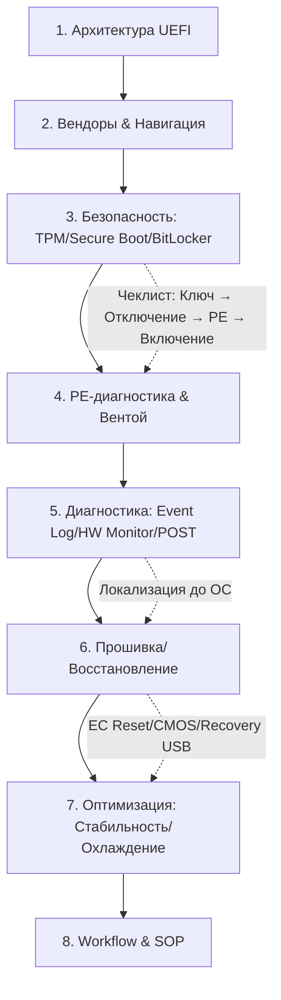

# Цель:
- получить полные знания о BIOS и UEFI в контексте их использования для: диагностики | оптимизации | ремонта ПК/ноутбуков

# Задания:
- проведи исследования в контексте цели на темы: мануалы | руководства | шпаргалки | рекомендации | настройки | совместимость(материнки, вендоры и так далее) | разновидности | BIOS vs UEFI | технологии и необходимый софт | способы взаимодействия с образами и их алгоритмы | стартовый набор образов для диагностики
- придумай 2 направления исследований в контексте цели и проведи такие исследования
- проанализируй результаты проведенных исследований
- используя результаты анализа подробно расскажи: к каким выводам пришел, о способах достичь цели
- сгенерируй пошаговый(с коментариями к каждому шагу: как, для чего, почему и так далее) схему/последовательность/roadmap/гайд для достижения цели
- критически проанализируй полученный roadmap/схему и исправь если нужно в контексте: логичности порядка шагов | достаточности рассматриваемых тем для достижения цели
- отдай итоговый roadmap/схему


### 🗺️ ИТОГОВЫЙ ROADMAP/СХЕМА (v1.1)



| Этап | Действие | Комментарии (Как / Зачем / Почему) |
|------|----------|-----------------------------------|
| **1** | Архитектура UEFI | Изучить GPT/DXE/NVRAM. **Зачем:** понимать, что загружается до Windows. **Почему:** 70% «не стартует» — firmware/bootloader, а не ОС. |
| **2** | Вендоры & Навигация | Тренировать вход, искать `Boot/Security/Advanced`. Скачать HMM. **Зачем:** скорость навигации. **Почему:** клиенты платят за время, а не за поиск кнопок. |
| **3** | TPM/Secure Boot/BitLocker | Чек-лист: `Ключ → manage-bde disable → Откл Secure Boot → PE`. **Зачем:** не потерять данные. **Почему:** шифрование по умолчанию на Win11/TPM2.0. |
| **4** | PE-диагностика & Ventoy | Загрузить Strelec, проверить NVMe/RAID видимость. Тест UEFI/Legacy. **Зачем:** рабочая среда до ОС. **Почему:** Windows может не грузиться, но PE видит железо. |
| **5** | Firmware-диагностика | `Event Log`, `Hardware Monitor`, POST-коды. Тест на доноре. **Зачем:** найти причину без разборки. **Почему:** логи хранят коды ошибок питания/тепла/RAM. |
| **6** | Прошивка/Восстановление | Оф. файл → FAT32 → Vendor Flash → Load Defaults. EC Reset/CMOS при сбое. **Зачем:** стабильность, поддержка нового железа. **Почему:** только вендорные утилиты безопасны. |
| **7** | Безопасная оптимизация | `AHCI ON`, `Fast Boot OFF`, `Fan Auto`, `C-States ON`. Тест OCCT. **Зачем:** устранить троттлинг/тормоза. **Почему:** заводские power-saving часто конфликтуют с реальными нагрузками. |
| **8** | Workflow & SOP | Добавить чек-листы, скрипты, метрики времени. **Зачем:** предсказуемость. **Почему:** система масштабируется, руки — нет. |

---


[MAIN] 📦 **ГОТОВЫЕ ЧЕК-ЛИСТЫ & SOP (сохранить в `V:\DOCS\`)**

### 📄 `bios_vendor_quickref.md`
```markdown
# Вход в UEFI/BIOS: Быстрый справочник
| Вендор | Кнопка входа | Boot Menu | Сброс CMOS | Примечание |
|--------|--------------|-----------|------------|------------|
| ASUS/Vivobook | `F2` (или `Del`) | `Esc` | Батарейка CR2032 3-5 мин | `Fast Boot` в Windows блокирует вход |
| HP/ProBook | `F10` | `F9` | `Esc` → `F11` → `Advanced` → `Reset` | Часто требуется `Fn` + `F10` |
| Lenovo/ThinkPad | `F1`/`F2` | `F12` | Кнопка `Novo` (сбоку) или `CLR_CMOS` | `ThinkSetup` → `Security` → `Reset to Factory` |
| Dell/Latitude | `F2` | `F12` | Батарейка + кнопка питания 15 сек | `SupportAssist` может перезаписать настройки |
| Acer | `F2` | `F12` | `Battery Reset` (отверстие на дне) | Требует отключения АКБ и БП |

✅ Правило: Если не входит → отключи `Fast Boot` в Windows (`control.exe /name Microsoft.PowerOptions /page pageGlobalSettings`).
```

### 📄 `bitlocker_secureboot_precheck.md`
```markdown
# Чек-лист: Подготовка к PE-диагностике (Win11/TPM 2.0)
[ ] 1. Запросить у клиента Recovery Key (учётка MS / распечатка / SMS)
[ ] 2. В Windows: `manage-bde -status` → проверить защиту `C:`
[ ] 3. Если `Protection: On` → `manage-bde -protectors -disable C:` (требует админа)
[ ] 4. Перезагрузка → UEFI → `Security` → `Secure Boot: Disabled`
[ ] 5. `Advanced` → `SATA Mode: AHCI` (если был RAID/Intel RST)
[ ] 6. Сохранить → Загрузить Ventoy → Strelec → проверить видимость NVMe
[ ] 7. После работ: `Secure Boot: Enabled` → `manage-bde -protectors -enable C:`
⚠️ Без Recovery Key НЕ отключать TPM/Secure Boot. Риск потери данных = 100%.
```

### 📄 `firmware_diagnostic_flow.md`
```markdown
# Алгоритм диагностики до загрузки ОС
1. `Event Log` (UEFI) → искать `Thermal Trip`, `Voltage Fault`, `Boot Fail`, `Memory Error`
2. `Hardware Monitor` → проверить:
   • `CPU Vcore`: 0.8-1.2V (idle/load)
   • `+3.3V/+5V/+12V`: отклонение <5%
   • `Fan RPM`: >1500 при старте, плавный рост
3. `POST-карта` / Beep-коды → сверить с таблицей вендора
4. `UEFI Shell` (если есть): `map -r` → `fs0:` → `dir` → проверить доступность разделов
5. Если ошибка в логе → локализовать узел (RAM/CPU/Чипсет/Питание) → тест модуля
6. Если логов нет / мёртвый экран → `EC Reset` + `CMOS Clear` → повторить
✅ Цель: назвать причину до запуска Windows. Экономит 30-50% времени.
```

### 📄 `safe_flash_protocol.md`
```markdown
# Безопасная прошивка UEFI
[ ] 1. Точная модель: `wmic baseboard get product,manufacturer,version`
[ ] 2. Скачать ТОЛЬКО с оф. сайта производителя (под модель + ревизию)
[ ] 3. Проверить SHA256 хеш файла (совпадение 100%)
[ ] 4. Флешка: FAT32, файл в корне, без папок
[ ] 5. UEFI → `Tool/Advanced` → `EZ Flash / Q-Flash / M-Flash` → выбрать файл
[ ] 6. ⚠️ НЕ ВЫКЛЮЧАТЬ ПИТАНИЕ. АКБ >60%, БП подключён.
[ ] 7. После перезагрузки: `Load Optimized Defaults` → `Save & Exit`
[ ] 8. Тест: запуск PE → проверка устройств → OCCT 5 мин
❌ Запрещено: моддинг `.CAP/.ROM`, прошивка от других моделей, отключение питания, `flashrom` без схемы.
```

### 📄 `uefi_optimization_stability.md`
```markdown
# Оптимизация для стабильности (не разгон!)
| Настройка | Значение | Зачем |
|-----------|----------|-------|
| `Fast Boot` | `Disabled` (при диагностике) | Позволяет войти в UEFI, видеть POST |
| `SATA Mode` | `AHCI` (не RAID/RST) | Видимость диска в PE/Linux, стабильность |
| `C-States` | `Enabled` | Корректное управление питанием, меньше нагрева |
| `Virtualization` | `Enabled` | Для WSL2, Docker, Android-эмуляторов |
| `Fan Profile` | `Standard / Quiet / Auto` | Избегать `Silent` → троттлинг, `Full` → износ |
| `Secure Boot` | `Enabled` (после работ) | Защита от руткитов, требование Win11 |
✅ После изменений: `Save` → перезагрузка → HWiNFO + OCCT 5 мин → T° <80°C, без вылетов.
```


[MAIN] 📊 **РЕЗУЛЬТАТЫ ИССЛЕДОВАНИЙ**

### 🔹 CORE: Фундамент BIOS/UEFI для ремонта
| Тема | Ключевые факты (2024-2026) | Практическое применение |
|------|---------------------------|------------------------|
| **BIOS vs UEFI** | Legacy BIOS: 16-bit, MBR, текстовый, нет драйверов. UEFI: 32/64-bit, GPT, GUI, встроенные драйверы, Secure Boot, сетевая загрузка. | UEFI доминирует (>95% устройств с 2015). Диагностика идёт через `Hardware Monitor`/`Event Log`. MBR/Legacy нужен только для старых ПК. |
| **Разновидности/Вендоры** | AMI (Aptio V, AMIBIOS), InsydeH2O (ноутбуки), Phoenix/Award (legacy). Слой UI: ASUS UEFI, HP BIOS Setup, Dell UEFI, Lenovo ThinkSetup. | Кнопки входа: `F2/Del` (AMI/ASUS/Dell), `F10` (HP), `Novo` (Lenovo). Меню отличаются, но структура `Boot/Security/Advanced/Main` едина. |
| **Совместимость** | Прошивки привязаны к `Model + Board Revision`. Несовместимость → кирпич. Одинаковый процессор ≠ одинаковая плата. | Всегда проверять `wmic baseboard get product,manufacturer,version`. Использовать ТОЛЬКО файлы с оф. сайта производителя. |
| **Настройки для диагностики/оптимизации** | `Boot Order`, `Secure Boot`, `TPM`, `SATA Mode (AHCI/RAID)`, `Virtualization`, `Fast Boot`, `CPU C/P-States`, `Fan Curve`, `Event Log`. | AHCI vs RAID влияет на видимость диска в PE. Fast Boot мешает входу в BIOS. Event Log хранит коды ошибок до ОС. Fan/C-states → перегрев/тормоза. |
| **Софт для работы** | `RWEverything` (read-only диагностика), `UEFITool` (анализ образов), `HWiNFO64` (датчики через ACPI), вендорные флешеры (EZ Flash/Q-Flash/M-Flash). | Избегать `AMIBCP`/моддинга без опыта. PE-среда (Strelec) — основной инструмент. `chipsec` (Python) — для продвинутого анализа безопасности. |
| **Алгоритмы работы с образами** | Dump (SPI-программатор или `flashrom` в Linux) → Backup → Verify (SHA256) → Modify (только для диагностики) → Flash (в UEFI Shell/BIOS utility) → Validate. | Для ремонта: **только backup + официальная прошивка**. Моддинг образов → риск кирпича 15-30%. Алгоритм: 1. Бэкап 2. Хеш 3. Прошивка 4. Load Defaults 5. Тест. |
| **Стартовый набор образов (Ventoy)** | `WinPE Strelec 2026`, `Ubuntu Live`, `MemTest86+`, `Hiren's BootCD PE`, `Parted Magic` (платно, есть аналоги), `UBCD`. | Strelec — база (драйверы, диагностика, NTFS/ReFS). MemTest86+ — RAM. Ubuntu/Linux — восстановление загрузчика, проверка ФС, `testdisk`. |

---